# 🏭 TwinOps

[](https://github.com/hadijannat/TwinOps/actions/workflows/ci.yml)
[](https://github.com/hadijannat/TwinOps/actions/workflows/security.yml)
[](https://codecov.io/gh/hadijannat/TwinOps)
[](https://pypi.org/project/twinops/)
[](https://www.python.org/downloads/)
[](https://opensource.org/licenses/MIT)
[](docker/)

> **Production-Grade AI Agents for BaSyx Digital Twins**

A reference architecture for event-driven, safety-governed industrial AI that interacts with Asset Administration Shell (AAS) runtimes.

---

## ✨ Why TwinOps?

| Feature | Benefit |
|:-------:|---------|
| 🔄 **Shadow Twin Sync** | Real-time state via MQTT — no split-brain issues |
| 🛡️ **5-Layer Safety** | RBAC → Interlocks → Simulation → HITL → Audit |
| 📜 **CovenantTwin** | Cryptographically signed policies embedded in AAS |
| ⚡ **Command-Monitor** | Async job handling with automatic progress tracking |
| 🔍 **Semantic Indexing** | Smart tool selection using TF-IDF capability matching |
| 🔗 **Hash-Chained Audit** | Tamper-evident immutable logging for compliance |

---

## 🚀 Quick Start

```mermaid
flowchart LR
    A["📦 Clone Repo"] --> B["🐳 Docker Compose Up"]
    B --> C["💬 Send Command"]
    C --> D["✅ See Response"]
    
    style A fill:#3498db,color:#fff
    style B fill:#2ecc71,color:#fff
    style C fill:#f39c12,color:#fff
    style D fill:#9b59b6,color:#fff
```



### Prerequisites

- Docker and Docker Compose
- Python 3.11+ (for local development)

### Run with Docker Compose

```bash
# Start all services (sandbox mode - no API key required)
docker compose up --build

# Send a command
curl -s http://localhost:8080/chat \
  -H 'Content-Type: application/json' \
  -H 'X-Roles: operator' \
  -d '{"message":"Set speed to 1200 RPM"}' | jq

# Response shows simulation was forced (HIGH risk operation)
```

### Run with Real LLM

```bash
# Set your API key
export ANTHROPIC_API_KEY=your-key-here

# Start with Anthropic provider
docker compose up -e TWINOPS_LLM_PROVIDER=anthropic \
  -e TWINOPS_ANTHROPIC_API_KEY=$ANTHROPIC_API_KEY
```

---

## 🏗️ Architecture

```mermaid
flowchart TB
    subgraph Agent["🤖 AI Agent Layer"]
        LLM["LLM Client<br/><i>Anthropic / OpenAI / Rules</i>"]
        CAP["Capability Index<br/><i>TF-IDF Semantic Search</i>"]
        SAFETY["Safety Kernel<br/><i>5-Layer Defense</i>"]
        ORCH["Orchestrator<br/><i>Tool Execution Loop</i>"]
    end
    
    subgraph Twin["📡 Digital Twin Layer"]
        SHADOW["Shadow Twin Manager<br/><i>MQTT Live Sync</i>"]
        CLIENT["Twin Client<br/><i>HTTP Operations</i>"]
        OPS["Operation Service<br/><i>Delegated Execution</i>"]
    end
    
    subgraph External["🏭 BaSyx Infrastructure"]
        MQTT[("MQTT Broker<br/>:1883")]
        AAS[("AAS Repository<br/>:8081")]
    end
    
    LLM --> ORCH
    CAP --> ORCH
    ORCH --> SAFETY
    ORCH --> SHADOW
    ORCH --> CLIENT
    SHADOW <--> MQTT
    CLIENT --> AAS
    OPS --> AAS
    
    style Agent fill:#e8f4fd,stroke:#3498db
    style Twin fill:#e8fdf4,stroke:#2ecc71
    style External fill:#fdf4e8,stroke:#f39c12
```



---

## 📊 How It Works

```mermaid
sequenceDiagram
    actor User
    participant Agent as 🤖 Agent
    participant Safety as 🛡️ Safety Kernel
    participant Shadow as 📡 Shadow Twin
    participant AAS as 🏭 AAS Repository
    
    User->>Agent: "Set speed to 1200 RPM"
    Agent->>Agent: LLM interprets intent
    Agent->>Safety: Evaluate SetSpeed(1200)
    
    Note over Safety: Layer 1: RBAC Check
    Safety->>Safety: Role 'operator' allowed ✓
    
    Note over Safety: Layer 2: Interlock Check
    Safety->>Shadow: Get current state
    Shadow-->>Safety: Temperature OK ✓
    
    Note over Safety: Layer 3: Risk Assessment
    Safety-->>Agent: HIGH risk → Force simulation
    
    Agent->>AAS: Simulate SetSpeed(1200)
    AAS-->>Agent: Simulation successful ✓
    
    Agent-->>User: "Simulation OK. Re-issue to execute."
```



---

## 🛡️ Five-Layer Safety Model

TwinOps implements defense-in-depth to prevent unsafe AI operations:

```mermaid
flowchart TB
    subgraph Defense["🛡️ Five-Layer Defense Model"]
        direction TB
        L5["📜 <b>Layer 5: Audit Logging</b><br/>Hash-chained tamper-evident logs"]
        L4["👤 <b>Layer 4: HITL Approval</b><br/>Human gates for CRITICAL operations"]
        L3["🔬 <b>Layer 3: Simulation Forcing</b><br/>Automatic dry-run for HIGH risk ops"]
        L2["⚠️ <b>Layer 2: Interlocks</b><br/>Predicate-based state guards"]
        L1["🔐 <b>Layer 1: RBAC</b><br/>Role-based access control"]
    end
    
    L1 --> L2 --> L3 --> L4 --> L5
    
    style L5 fill:#27ae60,color:#fff
    style L4 fill:#f39c12,color:#fff
    style L3 fill:#e67e22,color:#fff
    style L2 fill:#e74c3c,color:#fff
    style L1 fill:#9b59b6,color:#fff
```



### Risk Level Matrix

```mermaid
flowchart LR
    subgraph Matrix["Risk Levels & Controls"]
        LOW["🟢 <b>LOW</b><br/>Status queries"]
        MED["🟡 <b>MEDIUM</b><br/>Minor setpoint changes"]
        HIGH["🟠 <b>HIGH</b><br/>Equipment actuation"]
        CRIT["🔴 <b>CRITICAL</b><br/>Safety-critical ops"]
    end
    
    LOW --> E1["Execute Immediately"]
    MED --> E2["Execute Immediately"]
    HIGH --> S1["🔬 Simulation First"]
    CRIT --> H1["👤 Simulation + HITL"]
    
    style LOW fill:#27ae60,color:#fff
    style MED fill:#f1c40f,color:#000
    style HIGH fill:#e67e22,color:#fff
    style CRIT fill:#e74c3c,color:#fff
```



---

## 📜 CovenantTwin

CovenantTwin embeds **cryptographically signed safety policies** directly within the AAS:

```json
{
  "require_simulation_for_risk": "HIGH",
  "require_approval_for_risk": "CRITICAL",
  "role_bindings": {
    "operator": { "allow": ["StartPump", "StopPump", "SetSpeed"] },
    "viewer": { "allow": ["GetStatus"] },
    "maintenance": { "allow": ["*"] }
  },
  "interlocks": [
    {
      "id": "temp-high",
      "deny_when": {
        "submodel": "urn:example:submodel:operational",
        "path": "CurrentTemperature",
        "op": ">",
        "value": 95
      },
      "message": "Temperature too high"
    }
  ]
}
```

### 🔑 Signing Policies

```bash
# Generate key pair
python scripts/generate_policy_keypair.py --output keys/

# Sign policy
python scripts/sign_policy.py \
  --policy-file models/policy.json \
  --private-key keys/policy_private.pem \
  --output models/policy_signed.json
```

---

## 🧩 Components

### Core Services

| Service | Port | Description |
|---------|:----:|-------------|
| `agent` | 8080 | AI agent HTTP API |
| `twin-sandbox` | 8081 | Local AAS mock server |
| `opservice` | 8087 | Operation delegation service |
| `mqtt` | 1883 | MQTT broker for events |

### Key Modules

```mermaid
graph TB
    subgraph Modules["📦 Agent Modules"]
        SM["shadow.py<br/><i>Shadow Twin Manager</i>"]
        SG["schema_gen.py<br/><i>AAS → LLM Tool Converter</i>"]
        CI["capabilities.py<br/><i>Semantic Capability Index</i>"]
        SK["safety.py<br/><i>Safety Kernel</i>"]
        PS["policy_signing.py<br/><i>CovenantTwin Ed25519</i>"]
        OR["orchestrator.py<br/><i>Main Agent Loop</i>"]
    end
    
    OR --> SM & SK & CI
    SK --> PS
    SG --> CI
    
    style Modules fill:#f5f5f5,stroke:#333
```



---

## 💻 CLI Usage

```bash
# List pending approval tasks
twinops --base-url http://localhost:8081 list-tasks

# Approve a task
twinops approve --task-id task-abc123

# Reject a task
twinops reject --task-id task-abc123 --reason "Maintenance window"

# Verify audit log integrity
twinops verify-audit --log-path audit_logs/audit.jsonl

# Show recent audit entries
twinops show-audit --last 20 --filter-event executed
```

---

## 🚢 Deployment

### Docker Compose (Development)

```bash
docker compose up --build
```

### Docker Compose (BaSyx Integration)

```bash
docker compose -f docker-compose.basyx.yml up --build
```

### Kubernetes

```bash
# Apply with kustomize
kubectl apply -k deploy/k8s/

# Or individual resources
kubectl apply -f deploy/k8s/namespace.yaml
kubectl apply -f deploy/k8s/
```

---

## ⚙️ Configuration

Environment variables (prefix: `TWINOPS_`):

| Variable | Default | Description |
|----------|---------|-------------|
| `TWIN_BASE_URL` | `http://localhost:8081` | AAS repository URL |
| `MQTT_BROKER_HOST` | `localhost` | MQTT broker hostname |
| `MQTT_BROKER_PORT` | `1883` | MQTT broker port |
| `LLM_PROVIDER` | `rules` | LLM provider (rules/anthropic/openai) |
| `ANTHROPIC_API_KEY` | - | Anthropic API key |
| `AAS_ID` | `urn:example:aas:pump-001` | Target AAS identifier |
| `REPO_ID` | `default` | Repository ID for MQTT topics |
| `AUTH_MODE` | `none` | API auth mode (`none` or `mtls`) |
| `AUTH_EXEMPT_PATHS` | `["/health","/ready"]` | Paths exempt from auth (JSON array) |
| `OPSERVICE_AUTH_MODE` | `none` | Opservice auth mode (`none` or `hmac`) |
| `OPSERVICE_AUTH_EXEMPT_PATHS` | `["/health","/metrics"]` | Opservice auth exempt paths |
| `OPSERVICE_HMAC_SECRET` | - | Shared HMAC secret for opservice |
| `OPSERVICE_HMAC_HEADER` | `X-TwinOps-Signature` | HMAC signature header |
| `OPSERVICE_HMAC_TIMESTAMP_HEADER` | `X-TwinOps-Timestamp` | HMAC timestamp header |
| `OPSERVICE_HMAC_TTL_SECONDS` | `300` | Max age of HMAC signatures |
| `OPSERVICE_JOB_RETENTION_SECONDS` | `3600` | Retain completed opservice jobs for this long |
| `OPSERVICE_JOB_CLEANUP_INTERVAL` | `300` | Interval between opservice job cleanup sweeps |
| `MTLS_ROLE_MAP` | `{}` | JSON map of subject → roles (e.g., `{"CN=ops-client":["operator"]}`) |
| `MTLS_TRUST_PROXY_HEADERS` | `false` | Trust mTLS headers from a reverse proxy |
| `MTLS_SUBJECT_HEADER` | `X-SSL-Client-DN` | Header carrying client subject |
| `AGENT_WORKERS` | `1` | Uvicorn worker count for agent API |
| `METRICS_MULTIPROC_DIR` | - | Directory for Prometheus multiprocess mode |
| `MQTT_TLS_ENABLED` | `false` | Enable TLS for MQTT |
| `MQTT_TLS_CA_CERT` | - | CA certificate path for MQTT TLS |
| `MQTT_TLS_CLIENT_CERT` | - | Client cert path for MQTT TLS |
| `MQTT_TLS_CLIENT_KEY` | - | Client key path for MQTT TLS |
| `TRACING_ENABLED` | `false` | Enable OpenTelemetry tracing |
| `TRACING_OTLP_ENDPOINT` | - | OTLP collector endpoint |
| `TRACING_CONSOLE` | `false` | Emit traces to console |
| `TRACING_SERVICE_NAME` | - | Override service name for traces |
| `TOOL_CONCURRENCY_LIMIT` | - | Max concurrent tool executions |
| `LLM_CONCURRENCY_LIMIT` | - | Max concurrent LLM requests |
| `TOOL_EXECUTION_TIMEOUT` | - | Tool execution timeout (seconds) |
| `TOOL_RETRY_MAX_ATTEMPTS` | `1` | Retry attempts for transient tool errors |
| `TOOL_RETRY_BASE_DELAY` | `0.5` | Base delay for retry backoff |
| `TOOL_RETRY_MAX_DELAY` | `5.0` | Max delay for retry backoff |
| `TOOL_RETRY_JITTER` | `0.2` | Jitter ratio for retry backoff |
| `TOOL_IDEMPOTENCY_TTL_SECONDS` | `300` | TTL for tool idempotency cache |
| `TOOL_IDEMPOTENCY_MAX_ENTRIES` | `1000` | Max tool idempotency entries |
| `TOOL_IDEMPOTENCY_STORAGE` | `memory` | Idempotency storage backend (`memory`/`sqlite`) |
| `TOOL_IDEMPOTENCY_SQLITE_PATH` | `data/idempotency.sqlite` | SQLite path for idempotency |
| `JOB_POLL_MAX_INTERVAL` | `5.0` | Max backoff for job polling |
| `JOB_POLL_JITTER` | `0.1` | Jitter ratio for job polling |
| `TWIN_CLIENT_FAILURE_THRESHOLD` | `5` | Circuit breaker failures before opening |
| `TWIN_CLIENT_RECOVERY_TIMEOUT` | `30` | Seconds before half-open |
| `TWIN_CLIENT_HALF_OPEN_MAX_CALLS` | `3` | Successes required to close circuit |
| `TWIN_CLIENT_MAX_CONCURRENCY` | - | Max concurrent TwinClient HTTP calls |
| `TWIN_TLS_ENABLED` | `false` | Enable TLS for TwinClient HTTP |
| `TWIN_TLS_CA_CERT` | - | CA certificate path for TwinClient TLS |
| `TWIN_TLS_CLIENT_CERT` | - | Client cert path for TwinClient TLS |
| `TWIN_TLS_CLIENT_KEY` | - | Client key path for TwinClient TLS |
| `TWIN_TLS_INSECURE` | `false` | Disable TLS verification (not recommended) |
| `POLICY_CACHE_TTL_SECONDS` | `300` | Cache duration for safety policy |
| `POLICY_MAX_AGE_SECONDS` | - | Maximum policy age before reload/deny |

---

## 🔐 mTLS Authentication

When `TWINOPS_AUTH_MODE=mtls`, the API requires a client certificate. Roles and approver/rejector identity are derived from the certificate subject (or trusted proxy headers).

```bash
export TWINOPS_AUTH_MODE=mtls
export TWINOPS_MTLS_ROLE_MAP='{"CN=ops-client,OU=TwinOps":["operator","maintenance"]}'
export TWINOPS_MTLS_TRUST_PROXY_HEADERS=true
export TWINOPS_MTLS_SUBJECT_HEADER=X-SSL-Client-DN
```

> In mTLS mode, `X-Roles`, `X-Approver`, and `X-Rejector` headers are ignored.

---

## 🧰 Ops Runbook (mTLS)

### Generate a minimal CA + client cert (local/dev)

```bash
# Create a local CA
openssl genrsa -out ca.key 4096
openssl req -x509 -new -nodes -key ca.key -sha256 -days 3650 \
  -subj "/CN=TwinOps-CA" -out ca.crt

# Issue a client certificate
openssl genrsa -out client.key 2048
openssl req -new -key client.key -subj "/CN=ops-client/OU=TwinOps" -out client.csr
openssl x509 -req -in client.csr -CA ca.crt -CAkey ca.key -CAcreateserial \
  -out client.crt -days 365 -sha256
```

### Example reverse proxy (Nginx)

```nginx
server {
  listen 443 ssl;
  ssl_certificate     /etc/ssl/certs/server.crt;
  ssl_certificate_key /etc/ssl/private/server.key;
  ssl_client_certificate /etc/ssl/certs/ca.crt;
  ssl_verify_client on;

  location / {
    proxy_set_header X-SSL-Client-DN $ssl_client_s_dn;
    proxy_set_header X-Forwarded-Client-Cert $ssl_client_cert;
    proxy_pass http://agent:8080;
  }
}
```

Then enable proxy trust:

```bash
export TWINOPS_MTLS_TRUST_PROXY_HEADERS=true
export TWINOPS_MTLS_SUBJECT_HEADER=X-SSL-Client-DN
```

---

## 🔏 Opservice HMAC Auth (Service-to-Service)

Enable HMAC verification on opservice and signing from the agent:

```bash
export TWINOPS_OPSERVICE_AUTH_MODE=hmac
export TWINOPS_OPSERVICE_HMAC_SECRET="super-secret"
```

The agent will sign delegated operation calls automatically when the secret is configured.

---

## 📈 Multi-Worker & Metrics

```bash
export TWINOPS_AGENT_WORKERS=4
export TWINOPS_METRICS_MULTIPROC_DIR=/tmp/twinops-prom
```

- `/metrics` uses Prometheus multiprocess aggregation when `METRICS_MULTIPROC_DIR` is set.
- If you want `/metrics` unauthenticated in mTLS mode, add it to `TWINOPS_AUTH_EXEMPT_PATHS`.

---

## 🧭 Tracing

```bash
export TWINOPS_TRACING_ENABLED=true
export TWINOPS_TRACING_OTLP_ENDPOINT=http://localhost:4317
export TWINOPS_TRACING_SERVICE_NAME=twinops-agent
```

---

## 📈 Load Test (Quick)

```bash
python scripts/load_test_agent.py --requests 50 --concurrency 5
```

The `performance` GitHub Action runs the same script on demand.

---

## 🔁 Idempotency Store

To share idempotency across multiple workers or processes:

```bash
export TWINOPS_TOOL_IDEMPOTENCY_STORAGE=sqlite
export TWINOPS_TOOL_IDEMPOTENCY_SQLITE_PATH=data/idempotency.sqlite
```

---

## 📡 API Reference

### POST /chat

Send a natural language command to the agent.

```bash
curl -X POST http://localhost:8080/chat \
  -H 'Content-Type: application/json' \
  -H 'X-Roles: operator' \
  -d '{"message": "Start the pump"}'
```

**Response:**
```json
{
  "reply": "Simulation completed for 'StartPump'. To execute for real, re-issue with simulate=false.",
  "tool_results": [{
    "tool": "StartPump",
    "success": true,
    "simulated": true,
    "status": "simulated_only"
  }],
  "pending_approval": false,
  "task_id": null
}
```

### GET /health

Health check endpoint.

### POST /reset

Reset conversation history.

---

### Error responses

Errors use a consistent envelope:

```json
{
  "error": {
    "code": "missing_field",
    "message": "Missing 'message' field",
    "details": {"field": "message"}
  }
}
```

Common codes include `invalid_json`, `missing_field`, `not_found`, `unauthorized`, `forbidden`, and `operation_failed`.

---

## 🛠️ Development

### Local Setup

```bash
# Create virtual environment
python -m venv .venv
source .venv/bin/activate

# Install dependencies
pip install -e ".[dev]"

# Run tests
pytest

# Type checking
mypy src/twinops

# Linting
ruff check src/
```

### Project Structure

```
twinops/
├── src/twinops/
│   ├── agent/              # 🤖 AI agent components
│   │   ├── shadow.py       # Shadow Twin Manager
│   │   ├── schema_gen.py   # Tool schema generation
│   │   ├── capabilities.py # Capability index
│   │   ├── safety.py       # Safety kernel
│   │   ├── policy_signing.py # CovenantTwin
│   │   ├── orchestrator.py # Main agent loop
│   │   └── llm/            # LLM integrations
│   ├── sandbox/            # 📦 Local AAS mock
│   ├── opservice/          # ⚡ Operation delegation
│   ├── common/             # 🔧 Shared utilities
│   └── cli.py              # 💻 CLI tool
├── models/                 # 📄 Sample AAS data
├── scripts/                # 📜 Utility scripts
├── docker/                 # 🐳 Dockerfiles
├── deploy/k8s/             # ☸️ Kubernetes manifests
└── infra/                  # 🏗️ Infrastructure configs
```

---

### CI/CD Notes

- Container scans in `.github/workflows/security.yml` are skipped for docs-only PRs; they still run on schedules and when Docker/runtime files change.

---

## 📚 References

- [BaSyx Wiki - MQTT Feature](https://wiki.basyx.org/en/latest/content/user_documentation/basyx_components/v2/aas_repository/features/mqtt.html)
- [BaSyx Wiki - Operation Delegation](https://wiki.basyx.org/en/latest/content/user_documentation/basyx_components/v2/submodel_repository/features/operation-delegation.html)
- [IDTA-01001-3-0-1: AAS Metamodel](https://industrialdigitaltwin.org/content-hub/aasspecifications)

---

## 📄 License

MIT License - see [LICENSE](LICENSE) file.

---

<p align="center">
  <i>Developed by RWTH Aachen University — Chair of Information and Automation Systems</i>
</p>
